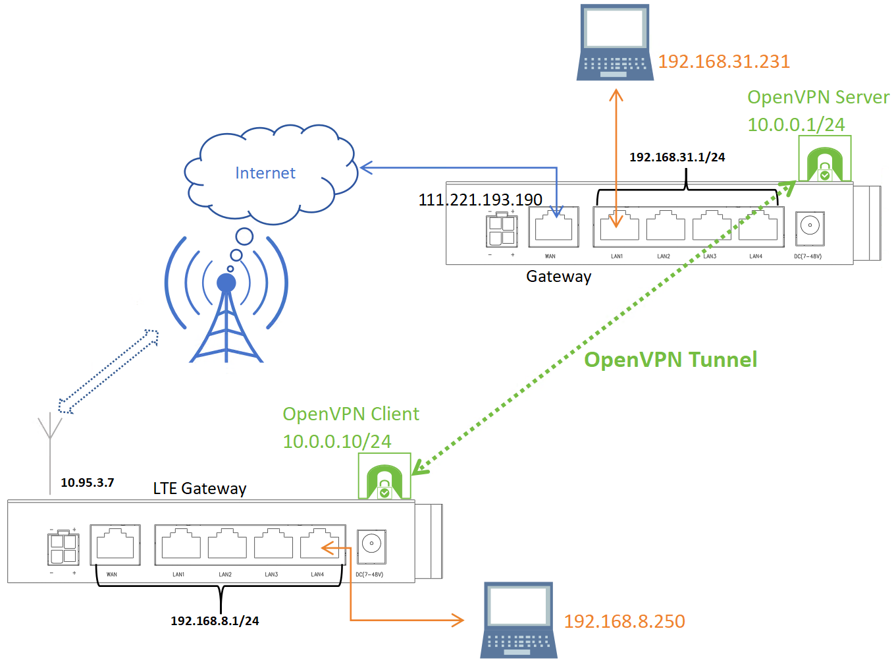
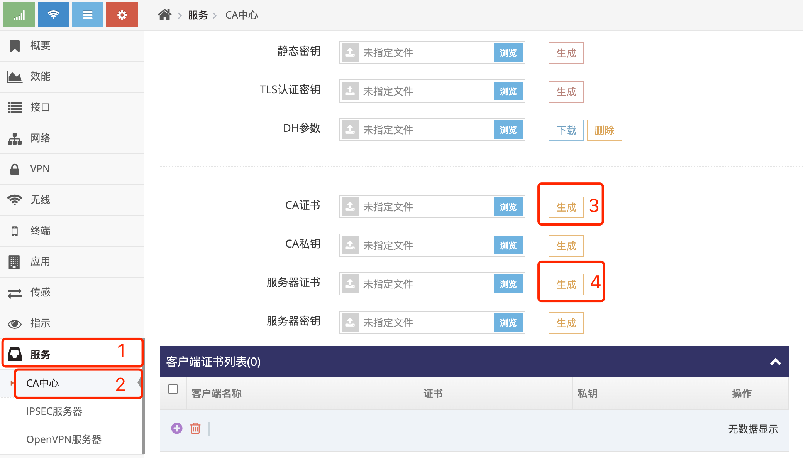
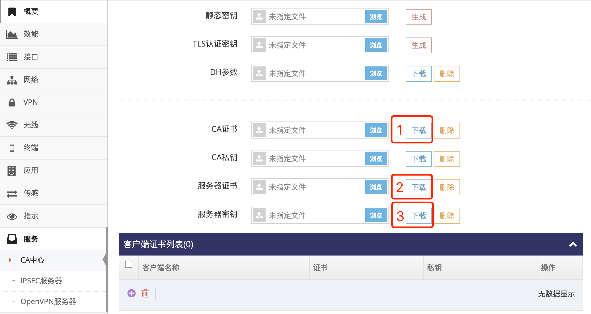
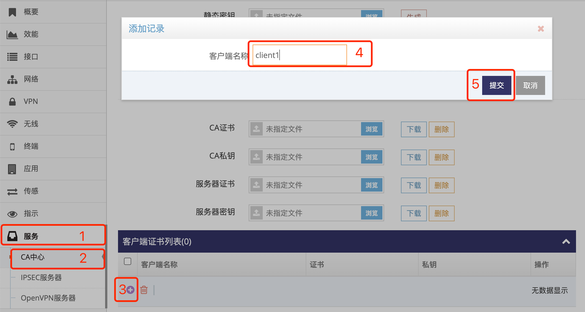
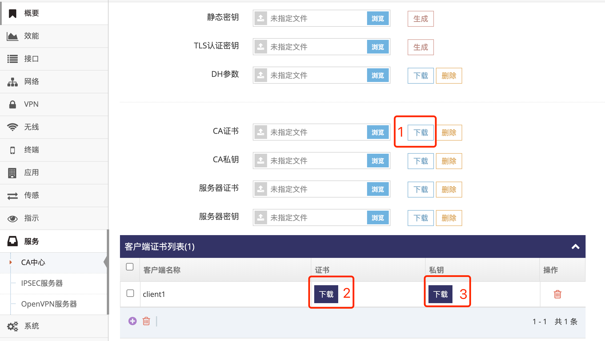
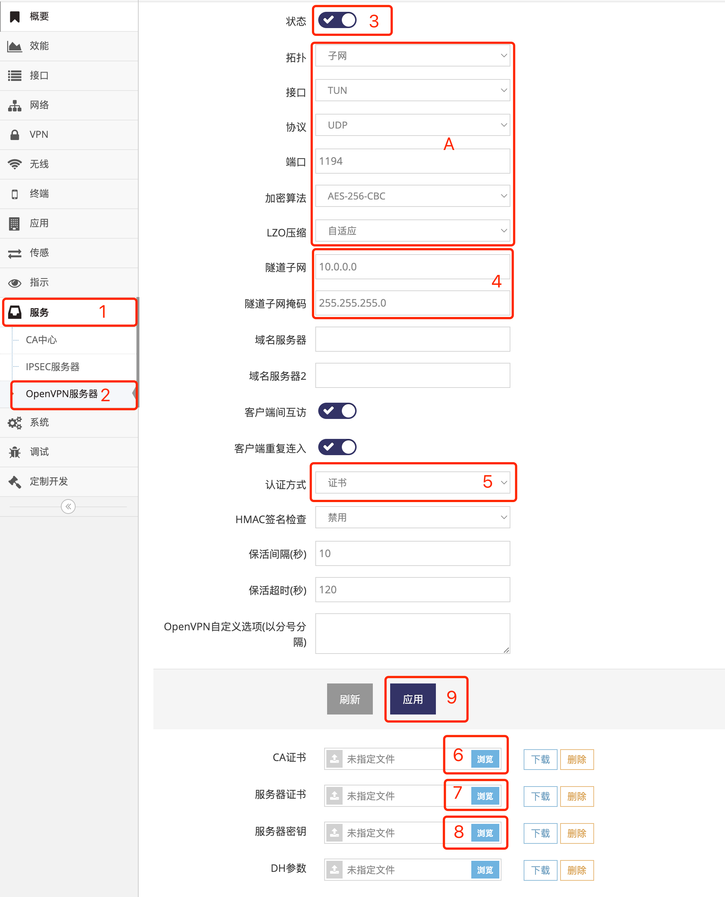
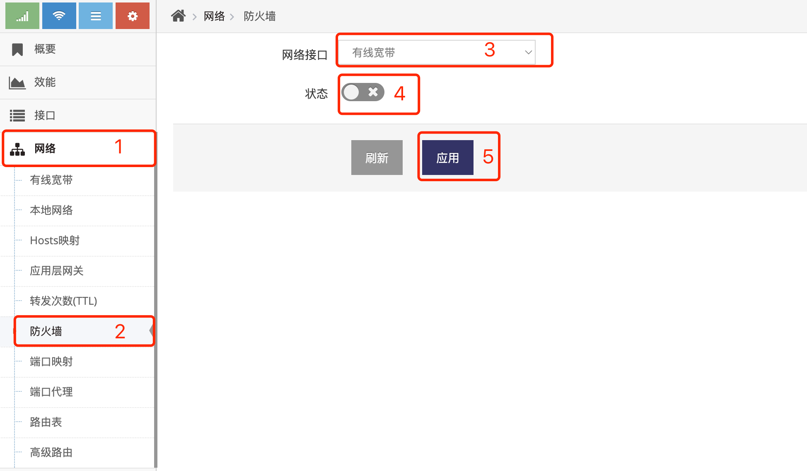
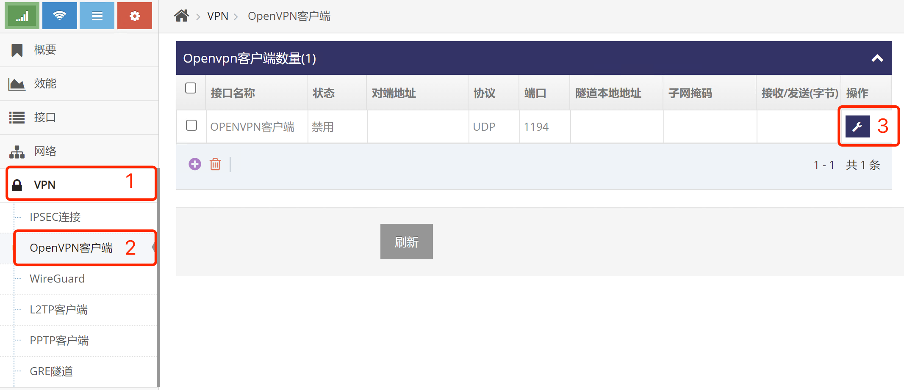
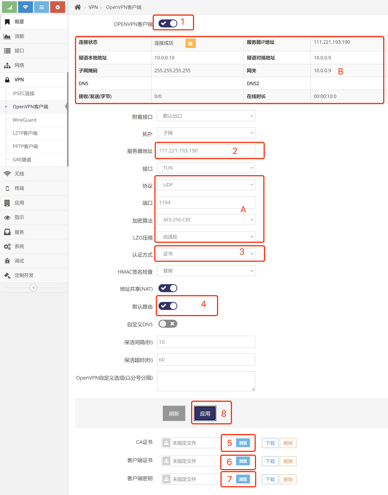
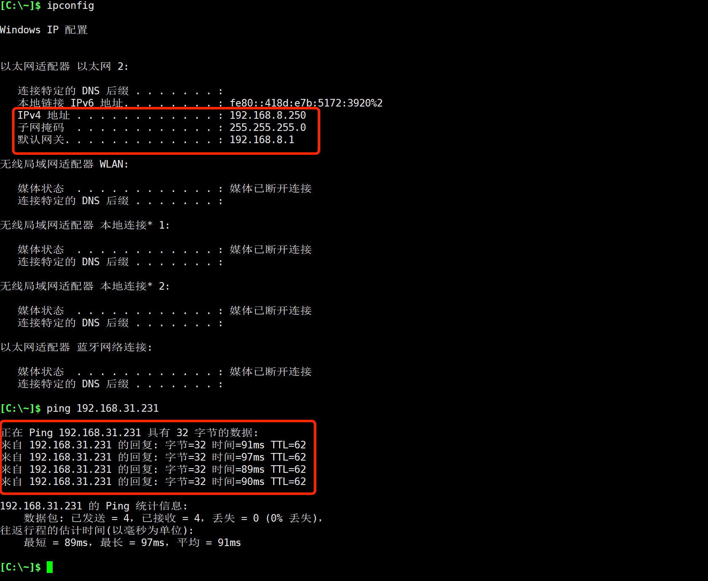

***

## 设置两台网关使用OpenVPN实现通信

设置OpenVPN可实现一台 **网关(OpenVPN客户端)** 下的设备访问另一台 **网关(OpenVPN服务器)** 下的设备, 前提需要 **网关(OpenVPN服务器)** 有 **公网地址**   

- 基于以下拓扑图示例设置OpenVPN实现 **网关(OpenVPN客户端)** 下 **电脑192.168.8.250** 访问另一台 **网关(OpenVPN服务器)** 下的 **电脑192.168.31.231**    

- 其中 **网关(OpenVPN服务器)** 使用有线宽带上网, 有线宽带有公网地址, 为 **111.221.193.190**    

- 另一台 **网关(OpenVPN客户端)** 使用4G(LTE)上网, 无公网地址   

- OpenVPN虚拟网段为 **10.0.0.0/24**, 其中作为OpenVPN服务器的 **网关(OpenVPN服务器)** 的OpenVPN接口IP为 **10.0.0.1**, 作为OpenVPN客户端的 **网关(OpenVPN客户端)** 的OpenVPN接口IP由OpenVPN服务器自动分配(图示为10.0.0.10)

 

## 设置有公网地址的网关(Gateway)为OpenVPN服务器

#### 1. 在CA中心生成CA证书及服务器证书

在配置 **OpenVPN服务器** 时需要上传CA证书及服务器的证书及密钥, 在 **CA中心界面** 可生成这些文件, 如果有第三方生成这些证书密钥则忽略这一步   
登录 **网关(OpenVPN服务器)** 的 **管理界面**, 以上拓扑图示的网关本地地址为192.168.31.1, 电脑连接 **网关(OpenVPN服务器)** 后打开浏览器在地址栏输入 http://192.168.31.1 回车即可登录

- 点击 **红框1** **服务** 菜单下的 **红框2** **CA中心** 进入 **CA中心界面**   

- 点击 **红框3** 生成CA证书及CA私钥  

- 点击 **红框4** 生成服务器证书及服务器密钥  

- 点击 **红框1** 及 **红框2** , **红框3** 的 **下载** 分别下载CA证书及OpenVPN服务器证书/私钥并保存好   

 

#### 2. 在CA中心生成CA证书及客户端证书

在配置 **OpenVPN客户端** 时需要上传CA证书及客户端的证书及密钥, 在 **CA中心界面** 可生成这些文件, 如果有第三方生成这些证书密钥则忽略这一步   
登录 **网关(OpenVPN服务器)** 的 **管理界面**, 以上拓扑图示的网关本地地址为192.168.31.1, 电脑连接 **网关(OpenVPN服务器)** 后打开浏览器在地址栏输入 http://192.168.31.1 回车即可登录

- 点击 **红框1** **服务** 菜单下的 **红框2** **CA中心** 进入 **CA中心界面**   

- 在以上 **1.在CA中心生成CA证书及服务器证书** 中已生成了CA证书及CA私钥, 因此可直接点击 **红框3** 生成客户端证书及密钥  

- 弹出添加记录对话框后在 **红框4** 中输入客户端名字, 之后点击 **红框5** 提交即可生成

- 点击 **红框1** 及 **红框2** , **红框3** 的 **下载** 分别下载CA证书及OpenVPN客户端证书/私钥并保存好   

 

#### 3. 配置OpenVPN服务器

登录 **网关(OpenVPN服务器)** 的 **管理界面**, 以上拓扑图示的网关本地地址为192.168.31.1, 电脑连接 **网关(OpenVPN服务器)** 后打开浏览器在地址栏输入 http://192.168.31.1 回车即可登录

- 点击 **红框1** **服务** 菜单下的 **红框2** **OpenVPN服务器** 进入 **OpenVPN服务器设置界面**   

- 点击 **红框3** 启用OpenVPN服务器

- 在 **红框4** 填写OpenVPN的虚拟网段, 默认OpenVPN服务器会使用虚拟网段中的第一个IP地址

- 点击 **红框5** **认证方式** 选择证书认证

- 点击 **红框6** **浏览** 选择上传在 **1.在CA中心生成CA证书及服务器证书** 中下载的CA证书或第三方的CA证书

- 点击 **红框7** **浏览** 选择上传在 **1.在CA中心生成CA证书及服务器证书** 中下载的服务器证书或第三方的服务器证书

- 点击 **红框8** **浏览** 选择上传在 **1.在CA中心生成CA证书及服务器证书** 中下载的服务器私钥或第三方的服务器私钥

- 点击 **红框9** **应用** 即设置好了OpenVPN服务器

- 在 **红框A** 还可以对OpenVPN的一些 **协议**, **端口**, **加密算法**, **LZO压缩** 选项做调整

 

#### 4. 配置防火墙

登录 **网关(OpenVPN服务器)** 的 **管理界面**, 以上拓扑图示的网关本地地址为192.168.31.1, 电脑连接 **网关(OpenVPN服务器)** 后打开浏览器在地址栏输入 http://192.168.31.1 回车即可登录

- 点击 **红框1** **网络** 菜单下的 **红框2** **防火墙** 进入 **防火墙设置界面**   

- 点击 **红框3** 选择 **有线宽带**, 示例中此网关使用有线宽带上网, OpenVPN服务器需要工作于有线宽带上

- 点击 **红框4** **状态** 禁用防火墙, 也可以配置防火墙只允许通过OpenVPN协议的数据, 防火墙的配置可见 **[允许外网访问网关指定的服务](../firewall/allow_access_cn.md)**   

- 点击 **红框5** **应用** 即可

 

## 设置4G网关(LTE Gateway)为OpenVPN客户端

#### 1. 配置OpenVPN客户端

登录 **4G网关(OpenVPN客户端)** 的 **管理界面**, 以上拓扑图示的网关本地地址为192.168.8.1, 电脑连接 **4G网关(OpenVPN客户端)** 后打开浏览器在地址栏输入 http://192.168.8.1 回车即可登录

- 点击 **红框1** **VPN** 菜单下的 **红框2** **OpenVPN客户端** 进入 **OpenVPN客户端列表界面**   

- 点击 **红框3** 进入对应的 **Openvpn客户端设置界面**

 

- 点击 **红框1** 启用OpenVPN客户端

- 在 **红框2** 填写OpenVPN服务器的地址, 此处为开启了 **OpenVPN服务器** 的有线网关, 即111.221.193.190

- 点击 **红框3** **认证方式** 选择证书认证

- 点击 **红框4** 开启 **默认路由**, 这将使得4G网关所有的外网数据都通过OpenVPN来传输

- 点击 **红框5* **浏览** 选择上传在 **1.在CA中心生成CA证书及服务器证书** 中下载的CA证书或第三方的CA证书

- 点击 **红框6** **浏览** 选择上传在 **2.在CA中心生成CA证书及客户端证书** 中下载的客户端证书或第三方的客户端证书

- 点击 **红框7** **浏览** 选择上传在 **2.在CA中心生成CA证书及客户端证书** 中下载的客户端私钥或第三方的客户端私钥

- 点击 **红框8** **应用** 即设置好了OpenVPN客户端

- 在 **红框A** 还可以对OpenVPN的一些 **协议**, **端口**, **加密算法**, **LZO压缩** 选项做调整

- **红框B** 显示OpenVPN客户端的状态, 当连接成功后在隧道本地地址显示当前OpenVPN客户端获取到的IP地址

 

#### 2. 使用电脑连接4G网关(LTE Gateway)访问有公网地址的网关(Gateway)后的设备

如拓扑图示例, 在电脑192.168.8.250上即可直接访问到192.168.31.231

 
