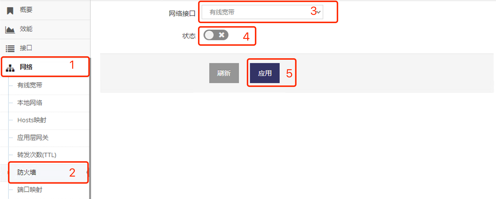

***

## 纯路由模式下有线宽带联网设置

纯路由模式网关WAN口上的 **上一级路由器(Router)** 可以直接访问到网关LAN上的 **设备或电脑**

 

只需要基于之前原有的 **有线宽带** 联网设置基础上禁用 **地址共享(NAT)**     

- 即在 **有线宽带设置界面** 点击 **红框1** 禁用即可

 

- 为了防止 **上一级路由器(Router)** 访问被防火墙阻止还需要禁用 **有线宽带** 的防火墙, 按以下红框数字步骤点选即可禁用

 
