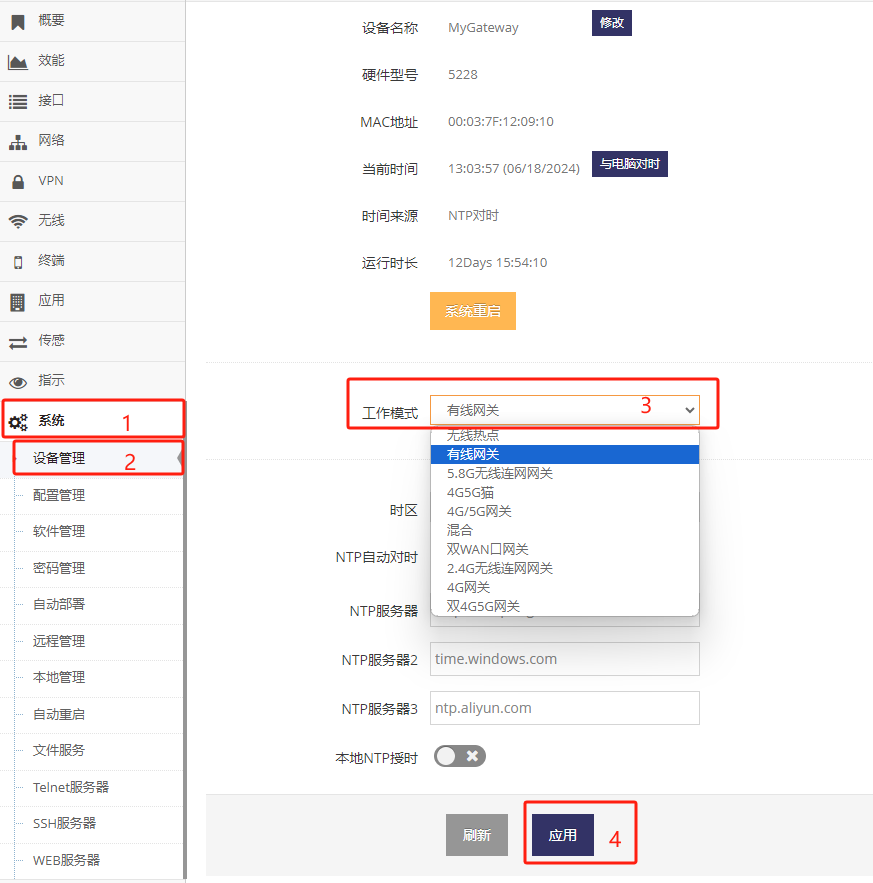
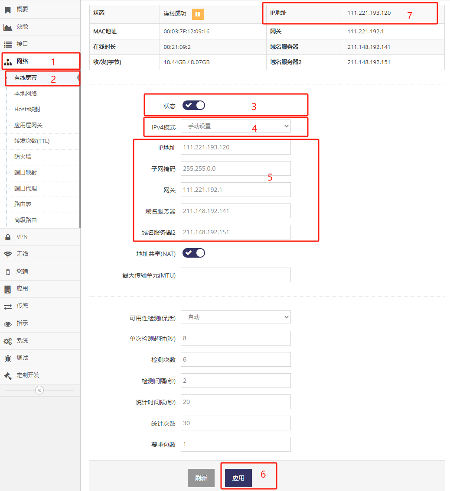
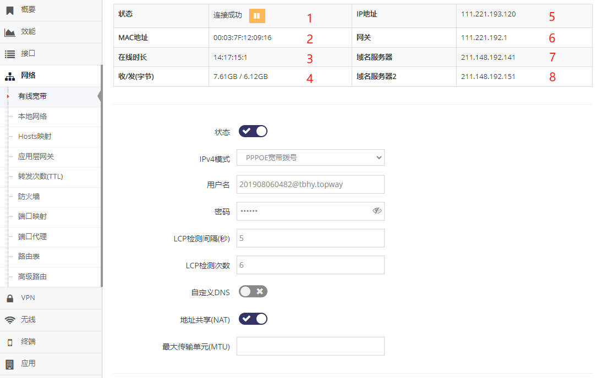

***

## 有线宽带静态地址上网设置

- 静态地址上网需要用户有一定的网络知识   
- 并且知道上一端路由器的地址(网关)以及域名服务器   
- 还要知道设置成什么地址才可以上网

 

#### 切换网关的工作模式

首先将网关的工作模式切换为 **有线网关**

- 点击 **红框1** 的 **系统** 菜单下的 **红框2** 的 **设备管理** 进入 **设备管理设置界面**   
- 点击 **红框3** 点击 **有线网关** 后, 点击 **红框4** 应用, 提示重启点击确定等待网关重启完成即可

 

在 **有线网关** 下, 网关的WAN口用于连接上一端的路由器
在 **有线网关** 下, 网关的所有LAN口可用于接电脑或是其它设备上网用

#### 设置有线宽带静态地址上网

- 点击 **红框1** 的 **网络** 菜单下的 **红框2** 的 **有线宽带** 进入 **有线宽带设置界面**

 

- 启用 **红框3** 的 **状态** 后, 点击 **红框4** 选择 **手动设置**

- 在 **红框5** 的 **IP地址** 填写要给网关设置的IP地址

- 在 **红框5** 的 **子网掩码** 填写要给网关设置的子网掩码

- 在 **红框5** 的 **网关** 填写上一级的路由器地址

- 在 **红框5** 的 **域名服务器** 填写可用的DNS服务器

- 之后点击 **红框6** 应用即可, 正常即可在 **红框7** 显示设置的 **IP地址**

***注意: IP地址必须与网关地址在同一个网段***

#### 有线宽带上网的可用性检测介绍

参见 **[4G/5G(LTE/NR)上网的可用性检测介绍](../lte/lte_apn_cn.md#4g5gltenr上网的可用性检测介绍为了ltenr网络的可靠性必须阅读)**

## 有线宽带网络的相关信息

#### 查看当前有线宽带网络的基本状态

在 **有线宽带设置界面** 的上面首先会显示当前有线宽带的基本状态

*通过在 **管理界面** 点击 **网络** 菜单下的 **有线宽带** 进入 **有线宽带设置界面***

 

- 1为当前的 **网络状态**, 正常网关会不同的阶段显示如下不同的状态:

    - **正在连接**, 表示正在拨号

    - **连接成功**, 表示已成功连接

    - **未连接**, 连接被手动断开或暂时因为网络问题离线, 网关通常间隔一段时间会恢复

- 2为当前的WAN口的 **MAC地址**

- 3为连接成功后一直连续 **在线时长**, 重新连接时会清零

- 4为当次连接累计的 **收发字节**, 出现重新连接时会清零

- 5为获取到的 **IP地址**, 连接成功时才会显示

- 6为获取到的 **网关**, 连接成功时才会显示

- 7为获取到的 **域名服务器**, 连接成功时才会显示

- 8为获取到的 **域名服务器2**, 连接成功时才会显示

### 查看当前有线宽带网络的所有状态信息

在 **管理界面** 点击 **接口** 将会显示 **有线宽带** 的所有状态信息

 

**红框2** 中显示所有 **有线宽带** 的信息

**红框3** 中显示 **WAN网口** 上是否有连接设备, 绿色的勾表示有设备, 红色的叉表示无设备
