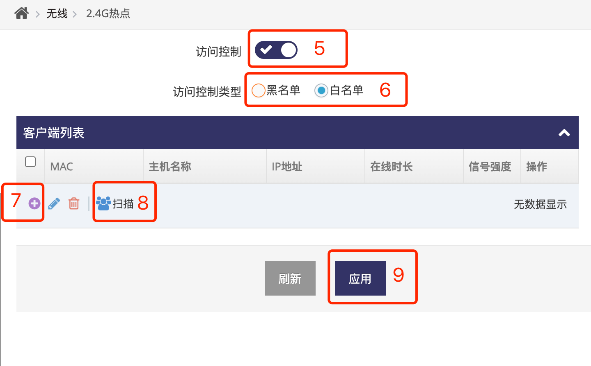
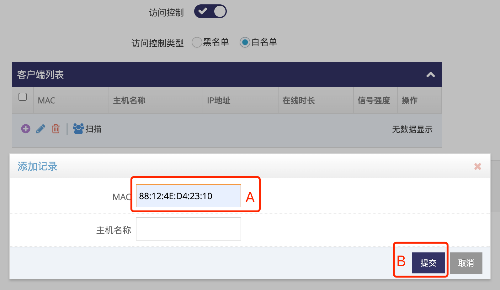
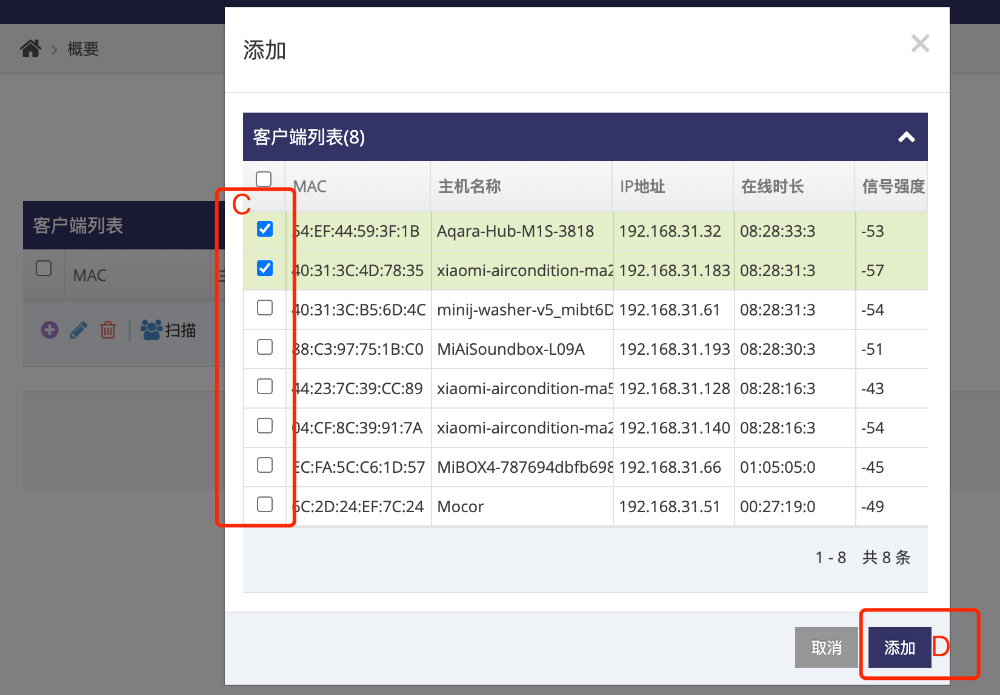
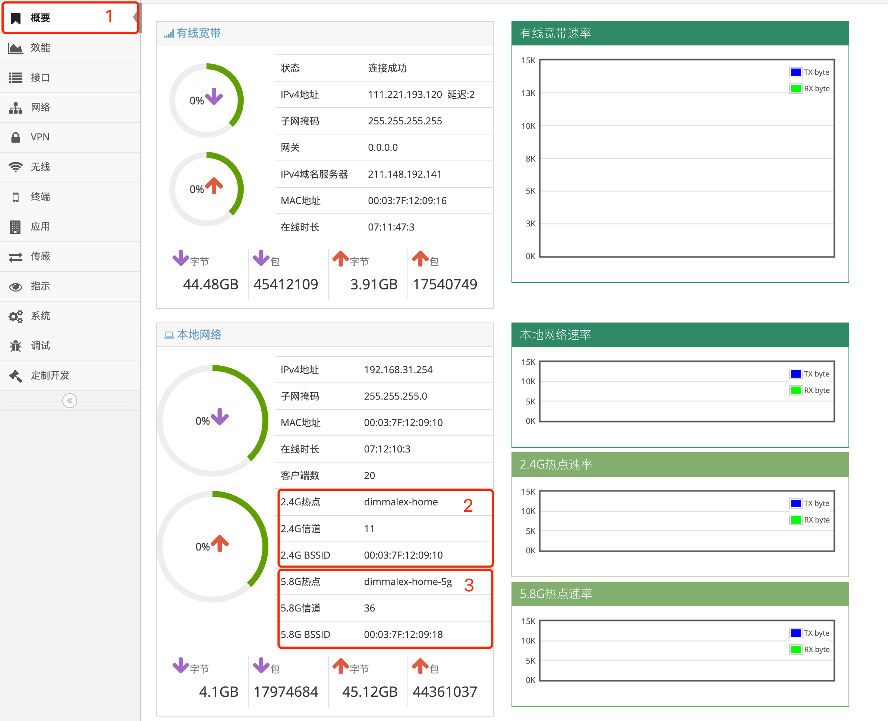
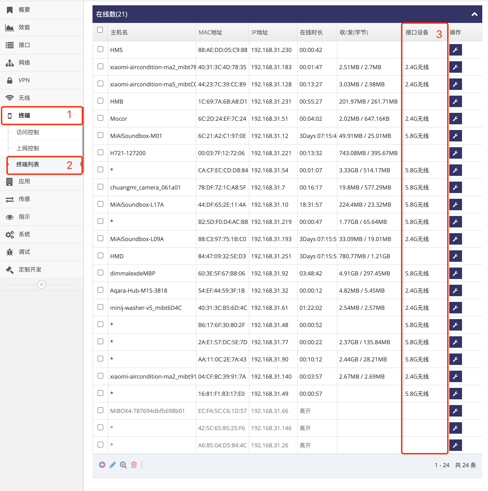

***

## 无线热点黑白名单设置

- 无线热点黑名单用于设置在名单中的设备无法连接热点   
- 无线热点白名单用于设置只允许名单中的设备连接热点

#### 启用2.4G(或5.8G)无线执点黑白名单

- 点击 **红框1** **无线** 菜单下的 **红框2** **2.4热点(或5.8G热点)** 进入 **2.4热点设置界面(或5.8G热点设置界面)**    

 

- 点击 **红框3** 启用 **2.4热点(或5.8G热点)**  
- 点击 **红框4** **访问控制设置** 进入 **2.4热点访问控制设置界面(或5.8G热点访问控制设置界面)**  

 

- 点击 **红框5** 启用 **访问控制**   
- 在 **红框6** 点选 **黑名单** 或 **白名单**
- 之后可以通过点击 **红框7** 的 **加号** 弹出对话框在 **红框A** 输入正确的 **MAC地址** 后点击 **红框B** **提交** 添加

 

- 也可以通过点击 **红框8** 的 **扫描** 弹出对话框点选 **红框C** 中对应的设备后点击 **红框B** **提交** 添加

 

- 之后点击 **红框9** 应用即可生效

## 无线热点相关状态

#### 查看无线热点基本状态

- 点击 **红框1** **概要** 进入 **概要界面**    

 

- **红框2** 的 **2.4G热点** 显示当前2.4G热点的 **SSID** 名称   
- **红框2** 的 **2.4G信道** 显示当前2.4G热点的 **信道**   
- **红框2** 的 **2.4G BSSID** 显示当前2.4G热点的 **MAC地址**   

- **红框3** 的 **5.8G热点** 显示当前2.4G热点的 **SSID** 名称   
- **红框3** 的 **5.8G信道** 显示当前2.4G热点的 **信道**   
- **红框3** 的 **5.8G BSSID** 显示当前2.4G热点的 **MAC地址**   

#### 查看无线热点接入的客户端

- 点击 **红框1** **终端** 菜单下的 **红框2** **终端列表** 进入 **终端列表管理界面**    

 

- 查看 **接口设备** 栏中为 **2.4G无线** 表示此行设备为 **2.4G热点** 的客户端   
- 查看 **接口设备** 栏中为 **5.8G无线** 表示此行设备为 **5.8G热点** 的客户端   
