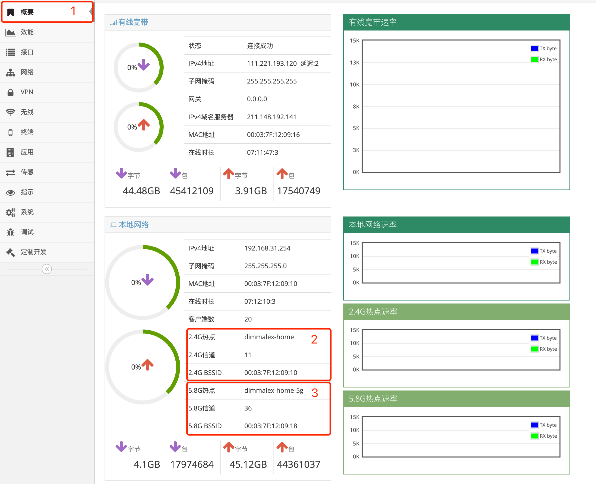
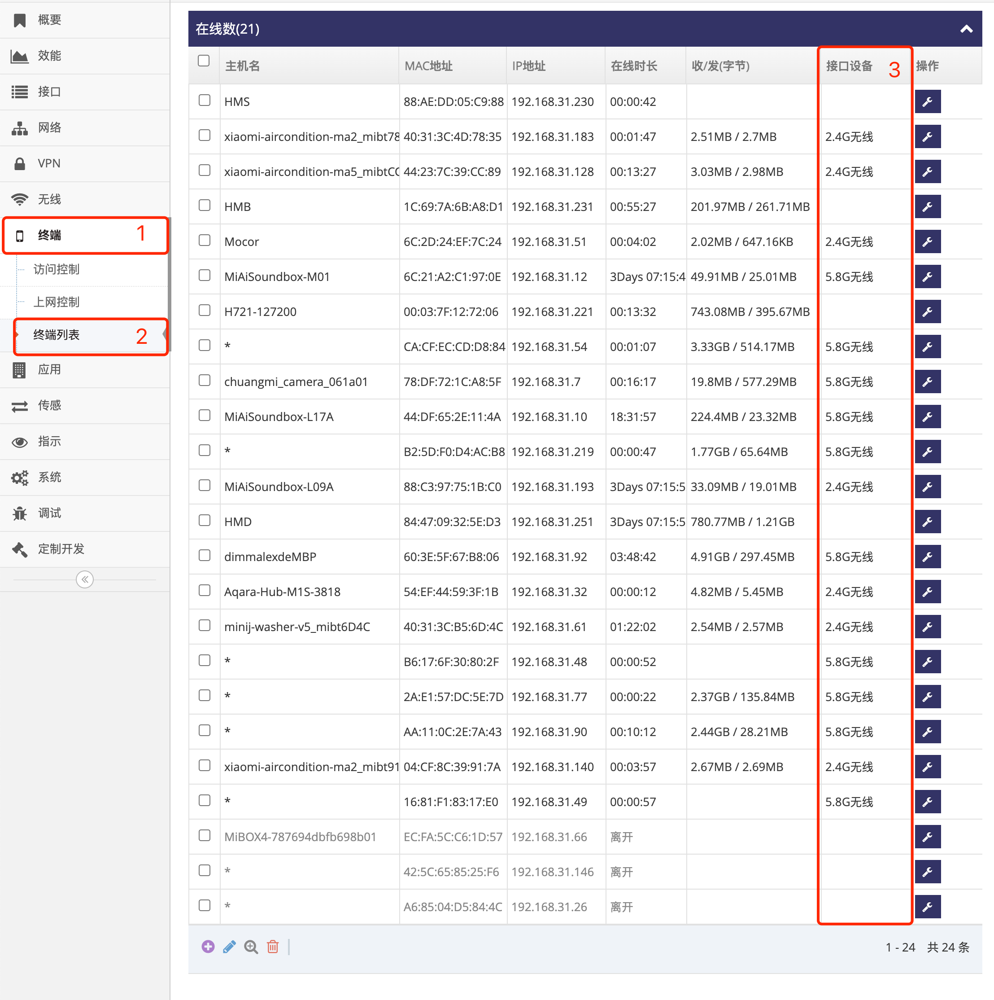

***

## 无线热点名称及密码信道等设置

支持无线功能的网关提供WIFI热点服务, 设备或电脑可以通过搜索并连接网关对应的热点

 

- 通常网关的SSID默认的名称为 **型号-MAC地址后6位**, 如以上图示型号为5218的网关(MAC地址为88124128870)发射的热点
- 如果网关支持5.8G, 还会有一个SSID默认名称为 **型号-5G-MAC地址后6位** 的5.8G的热点
- 出厂默认的密码则通常都为 **87654321**

#### 2.4G(或5.8G)无线执点设置

- 点击 **红框1** **无线** 菜单下的 **红框2** **2.4热点(或5.8G热点)** 进入 **2.4热点设置界面(或5.8G热点设置界面)**    

 

- 点击 **红框3** 启用 **2.4热点(或5.8G热点)**    
- 在 **红框4** 输入框中输入 **SSID** 名称   
- 在 **红框5** 选择 **安全模式**, **禁用** 表示无密码即可接入, 选择 **WPA-PSK**, **WPA2-PSK**, **WPA混合** 表示需要密码才能连接   
- 在 **红框5** 选择 **加密模式**, 可选 **AES**, **TKIP** 或 **自动**   
- 在 **红框5** **密码** 输入框中输入密码, 密码长度不允许小于8位   
- 之后点击 **红框6** **应用** 即可   

#### 2.4G(或5.8G)无线执点国家代码信道等高级设置

- 在 **2.4热点设置界面(或5.8G热点设置界面)** 的下方有相关的信道等高级设置

 

- **红框1**  **隐藏SSID** 启用后通过扫描将无法扫描到此SSID    
- **红框2**  **隔商客户端** 启用后则连接上热点的客户端之间无法相互访问   
- **红框3**  **频宽** 中可选择无线热点的频宽, 频宽越宽传输的数率就越高    
- **红框4**  **国家** 中选择对应的国家, 不同的国家会有不同的信道选择范围    
- **红框5**  **信道** 中选择信道, 比如2.4G热点, 国家为中国时信道可选为1-13, 而国家如果选为美国信道可选就为1-11, 信道选为 **自动** 则表示允许热点在开机时自动选择一个工作信道   
- **红框4**  **发射功率** 中选择热点的发射功率, 默认值则会网关最大能发射的功率, 调整发射功率会影响无线热点的信号强度   

## 无线热点相关状态

#### 查看无线热点基本状态

- 点击 **红框1** **概要** 进入 **概要界面**    

 

- **红框2** 的 **2.4G热点** 显示当前2.4G热点的 **SSID** 名称   
- **红框2** 的 **2.4G信道** 显示当前2.4G热点的 **信道**   
- **红框2** 的 **2.4G BSSID** 显示当前2.4G热点的 **MAC地址**   

- **红框3** 的 **5.8G热点** 显示当前2.4G热点的 **SSID** 名称   
- **红框3** 的 **5.8G信道** 显示当前2.4G热点的 **信道**   
- **红框3** 的 **5.8G BSSID** 显示当前2.4G热点的 **MAC地址**   

#### 查看无线热点接入的客户端

- 点击 **红框1** **终端** 菜单下的 **红框2** **终端列表** 进入 **终端列表管理界面**    

 

- 查看 **接口设备** 栏中为 **2.4G无线** 表示此行设备为 **2.4G热点** 的客户端   
- 查看 **接口设备** 栏中为 **5.8G无线** 表示此行设备为 **5.8G热点** 的客户端   
