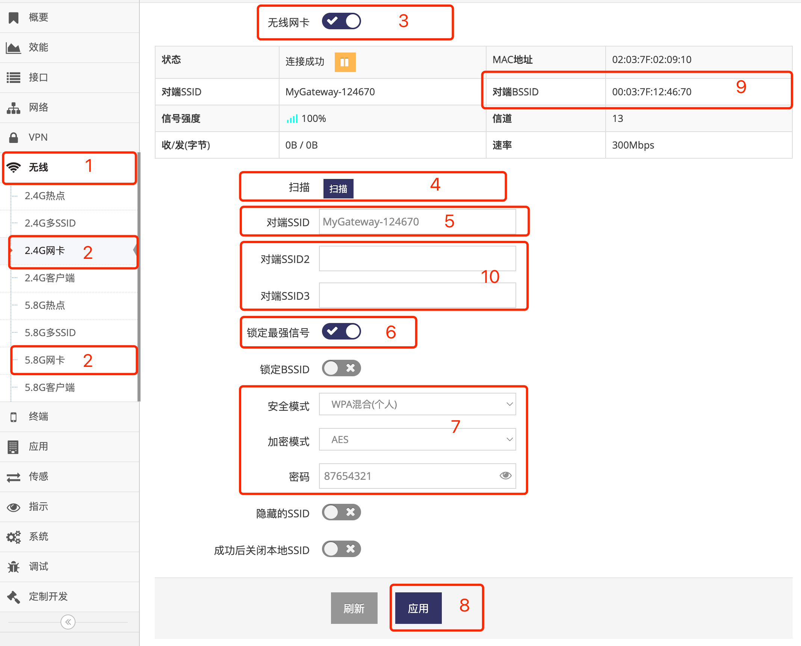
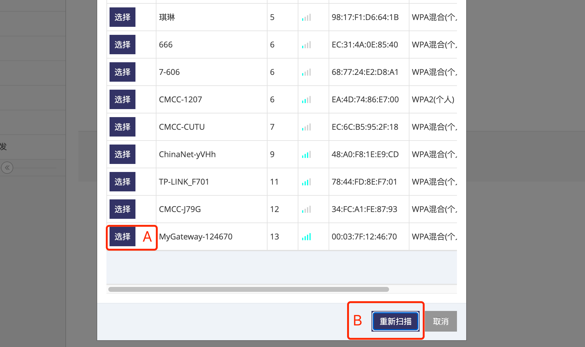
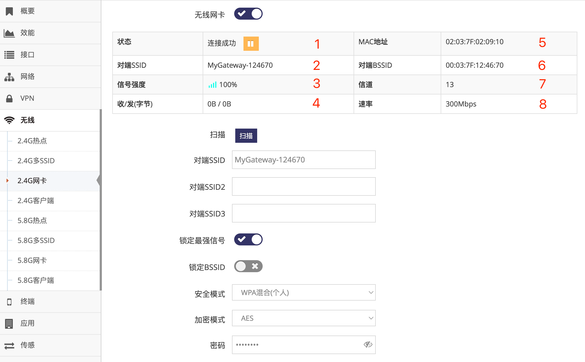

***

## 中继其它热点的设置

在非无线连网模式下都可以设置网关的 **无线网卡** 连接到其它的SSID实现中继功能, 中继后相当与将网关的LAN口与中继的SSID相连   

#### 设置无线网卡中继其它热点

- 点击 **红框1** **无线** 菜单下的 **红框2** **2.4G网卡**(或**5.8G网卡**) 进入 **2.4G网卡设置界面**(或**5.8G网卡设置界面**)

 

- 点击 **红框3** 打开无线网卡功能

- 点击 **红框4** 的 **扫描** 后, 弹出当前附近的SSID列表, 点击对应SSID前 **红框A** 的 **选择** 后会将SSID信息自动填入 **红框5** 及 **红框7** 中, 然后用户只需在 **红框7** 中的 **密码** 栏填写密码即可

 

- 也可直接在 **红框5** 中填入要连接的 **SSID名称** 并在 **红框7** 中填写对应的 **安全模式** **加密模式**及 **密码**, 必须要填写正确否则将无法连接   

- 之后点击 **红框8** 应用即可   

- 正常等待1分钟右左即可连接成功,  连接成功后在 **红框9** 将显示获取到的 **对端BSSID**   

    - **红框10** 用于填写多个安全方式完全相同的SSID, 网关将连接他们之中的SSID   
    - **红框6** 用于锁定最强信号, 当连接的SSID有多个设备或连接多个SSID时(红框5)时必须点选   
    - **红框B** 用于当热点列表中未显示对应的SSID时可点 **重新扫描** 直到能显示需要连接的SSID   

## 中继的网卡相关信息

在 **2.4G网卡设置界面**(或**5.8G网卡设置界面**) 的上面首先会显示当前网卡连网的基本状态

*通过在 **管理界面** 点击 **无线** 菜单下的 **2.4G网卡**(或**5.8G网卡**) 进入*

 

- 1为当前的 **网络状态**, 正常网关会在不同的阶段显示如下不同的状态:

    - **正在连接**, 表示正在拨号

    - **连接成功**, 表示已成功连接

    - **未连接**, 连接被手动断开或暂时因为网络问题离线, 网关通常间隔一段时间会恢复

- 2为当前连接的 **SSID**

- 3为当前连接的SSID的 **信号强度**

- 4为当次连接累计的 **收发字节**, 出现重新连接时会清零( MTK方案中此收发字节不统计将始终为0 )

- 5为当前的无线网卡的 **MAC地址**

- 6为当前连接的 **BSSID**, 即连接SSID设备的MAC地址

- 7为当前连接的SSID的 **信道**

- 8为当前连接的SSID理论最大 **速率**

