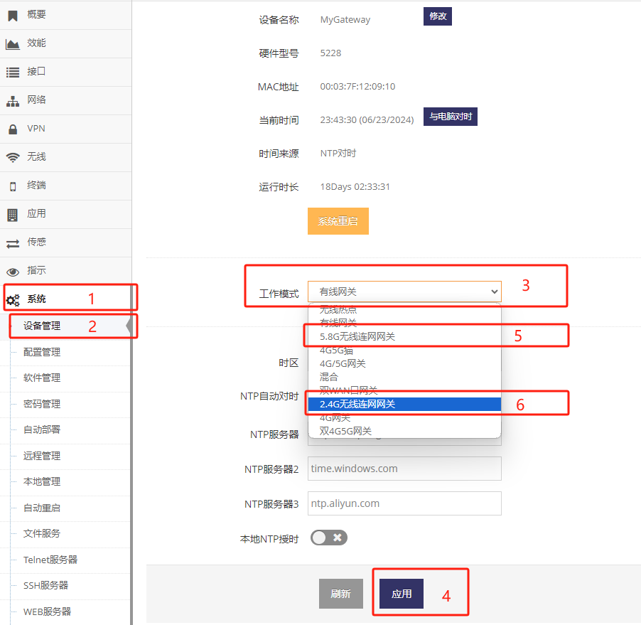
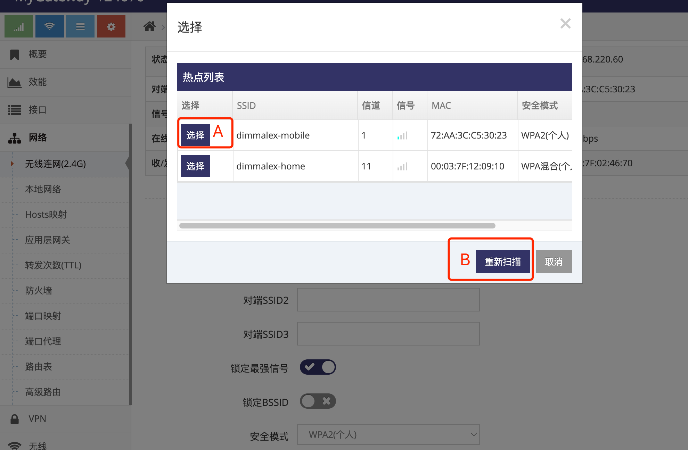
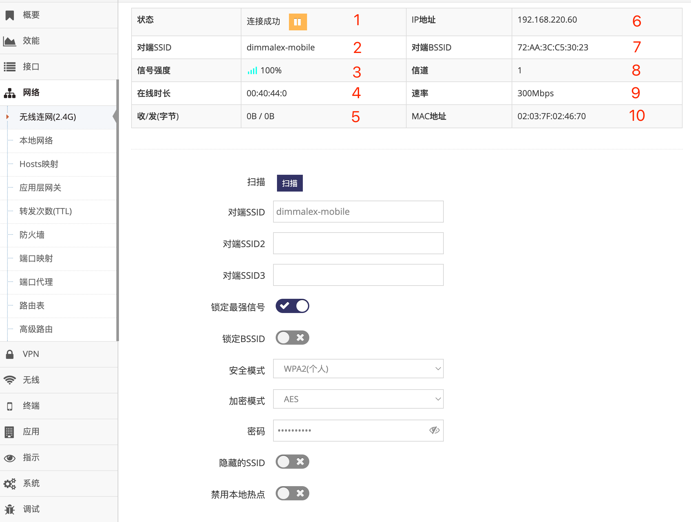
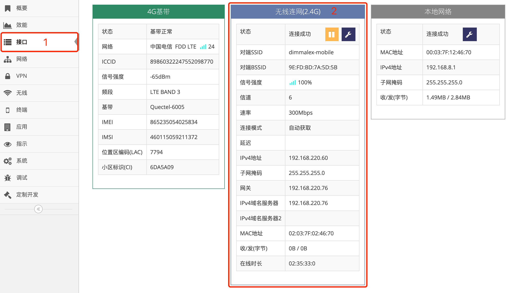

***

## 无线连网自动获取(DHCP)地址设置

无线连网自动获取(DHCP)需要以下前提:

- 有支持DHCP分配IP地址服务的无线热点, 即 **上一级路由器(Router)** 提供WIFI热点服务

 


#### 1. 切换无线连网模式

- 点击 **红框1** **系统** 菜单下的 **红框2** **设备管理** 进入 **设备管理设置界面**   

- 点击 **红框3** **工作模式** 点选 **2.4G无线连网网关**(或**5.8G无线连网网关**) 后, 提示需要重启点击 **确定** 等待网关重启完成即可   

 

具体切换为 **2.4G无线连网网关** 还是 **5.8G无线连网网关** 取决于要连接的SSID是 **2.4G** 的还是 **5.8G** 的热点    
在 **2.4G无线连网网关**(或**5.8G无线连网网关**) 模式下, 网关的WAN/LAN口及无线都在同一个广播域, 在使用中WAN口与LAN口无区别    

```shell
# 命令行操作
# network@frame:mode            // 查询当前工作模式
gateway                               // gateway表示为有线网关
# network@frame:mode=wisp       // 切换无线连网模式
ttrue                                 // ttrue表示成功
# network@frame:mode            // 再次查询当前工作模式
wisp                                  // wisp表示为2.4G无线连网关
# land@machine.restart         // 重启系统
```


#### 2. 设置无线连网自动获取(DHCP)地址

- 将电脑通过有线接入网关来设置网关的无线连网功能( **如通过无线连接网关在设置时会出现电脑与网关的连接断开而影响设置** )    

- 点击 **红框1** **网络** 菜单下的 **红框2** **无线连网(2.4G)**(或**无线连网(5.8G)**) 进入 **无线连网(2.4G)设置界面**(或**无线连网(5.8G)设置界面**)

 

- 点击 **红框3** 的 **扫描** 后, 弹出当前附近的SSID列表, 点击对应SSID前 **红框A** 的 **选择** 后会将SSID信息自动填入 **红框4** 及 **红框7** 中, 然后用户只需在 **红框7** 中的 **密码** 栏填写密码即可

 

- 也可直接在 **红框4** 中填入要连接的 **SSID名称** 并在 **红框7** 中填写对应的 **安全模式** **加密模式**及 **密码**, 必须要填写正确否则将无法连接   

- 在 **红框8** 中点选 **自动获取**, 之后点击 **红框9** 应用即可   

- 正常等待1分钟右左即可连接成功, 连接成功后在 **红框10** 将显示获取到的 **IP地址**   

    - **红框5** 用于填写多个安全方式完全相同的SSID, 网关将连接他们之中的SSID   
    - **红框6** 用于锁定最强信号, 当连接的SSID有多个设备或连接多个SSID时(红框5)时必须点选   
    - **红框B** 用于当热点列表中未显示对应的SSID时可点 **重新扫描** 直到能显示需要连接的SSID   

```shell
# 命令行操作
# ifname@wisp.aplist                 // 扫描当前附近2.4G的无线热点
{
    "86:31:AF:BB:E0:7D":
    {
        "ssid":"dimmalex-mobile",
        "channel":"6",
        "secure":"wpa2psk",
        "wpa_encrypt":"aes",
        "sig":"34",
        "signal":"2",
        "chext":"none",
        "mode":"11b/g/n"
    },
    "00:03:7F:12:09:10":
    {
        "ssid":"dimmalex-home",
        "channel":"11",
        "secure":"wpapskwpa2psk",
        "wpa_encrypt":"aes",
        "sig":"55",
        "signal":"3",
        "chext":"none",
        "mode":"11b/g/n"
    }
}
# ifname@wisp|{"mode":"dhcpc","peer":"dimmalex-mobile","secure":"wpa2psk","wpa_encrypt":"aes","wpa_key":"cf8k2bn519","strong":"enable"}    // 设置连接名为dimmalex-mobile的SSID
ttrue
# ifname@wisp.status                 // 查询状态, 显示连接成功
{
    "mode":"dhcpc",
    "ifname":"ifname@wisp",
    "netdev":"apcli0",
    "gw":"192.168.110.8",
    "dns":"192.168.110.8",
    "dns2":"",
    "ifdev":"wifi@nsta",
    "ontime":"00:48:17:0",
    "metric":"10",
    "status":"up",
    "ip":"192.168.110.60",
    "mask":"255.255.255.0",
    "livetime":"00:49:30:0",
    "rx_bytes":"0",
    "rx_packets":"0",
    "tx_bytes":"0",
    "tx_packets":"0",
    "mac":"02:03:7F:02:46:70",
    "tid":"5",
    "state":"up",
    "peer":"dimmalex-mobile",
    "peermac":"86:31:AF:BB:E0:7D",
    "channel":"1",
    "rate":"300",
    "sig":"34",
    "signal":"2"
}
#
```


#### 无线连网的可用性检测介绍

参见 **[4G/5G(LTE/NR)上网的可用性检测介绍](../lte/lte_apn_cn.md#4g5gltenr上网的可用性检测介绍为了ltenr网络的可靠性必须阅读)**


## 无线连网网络的相关信息

#### 查看当前无线连网网络的基本状态

在 **无线连网(2.4G)设置界面**(或**无线连网(5.8G)设置界面**) 的上面首先会显示当前无线连网的基本状态

*通过在 **管理界面** 点击 **网络** 菜单下的 **无线连网(2.4G)**(或**无线连网(5.8G)**) 进入*

 

- 1为当前的 **网络状态**, 正常网关会在不同的阶段显示如下不同的状态:

    - **正在连接**, 表示正在连接

    - **连接成功**, 表示已成功连接

    - **未连接**, 连接被手动断开或暂时因为网络问题离线, 网关通常间隔一段时间会恢复

- 2为当前连接的 **SSID**

- 3为当前连接的SSID的 **信号强度**

- 4为连接成功后一直连续 **在线时长**, 重新连接时会清零

- 5为当次连接累计的 **收发字节**, 出现重新连接时会清零( MTK方案中此收发字节不统计将始终为0 )

- 6为获取到的 **IP地址**, 连接成功时才会显示

- 7为当前连接的 **BSSID**, 即连接SSID设备的MAC地址

- 8为当前连接的SSID的 **信道**

- 9为当前连接的SSID理论最大 **速率**

- 10为当前的WISP口的 **MAC地址**


### 查看当前无线连网网络的所有状态信息

在 **管理界面** 点击 **接口** 将会显示 **无线连网(2.4G)**(或**无线连网(5.8G)**) 的所有状态信息

 

**红框2** 中显示所有 **无线连网(2.4G)**(或**无线连网(5.8G)**) 的信息   
