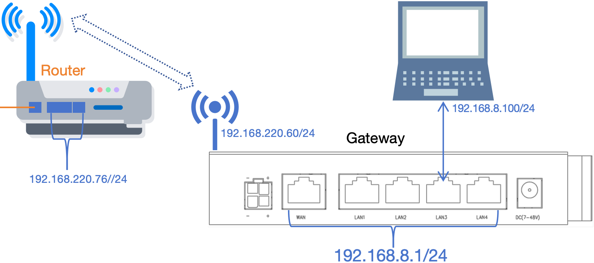
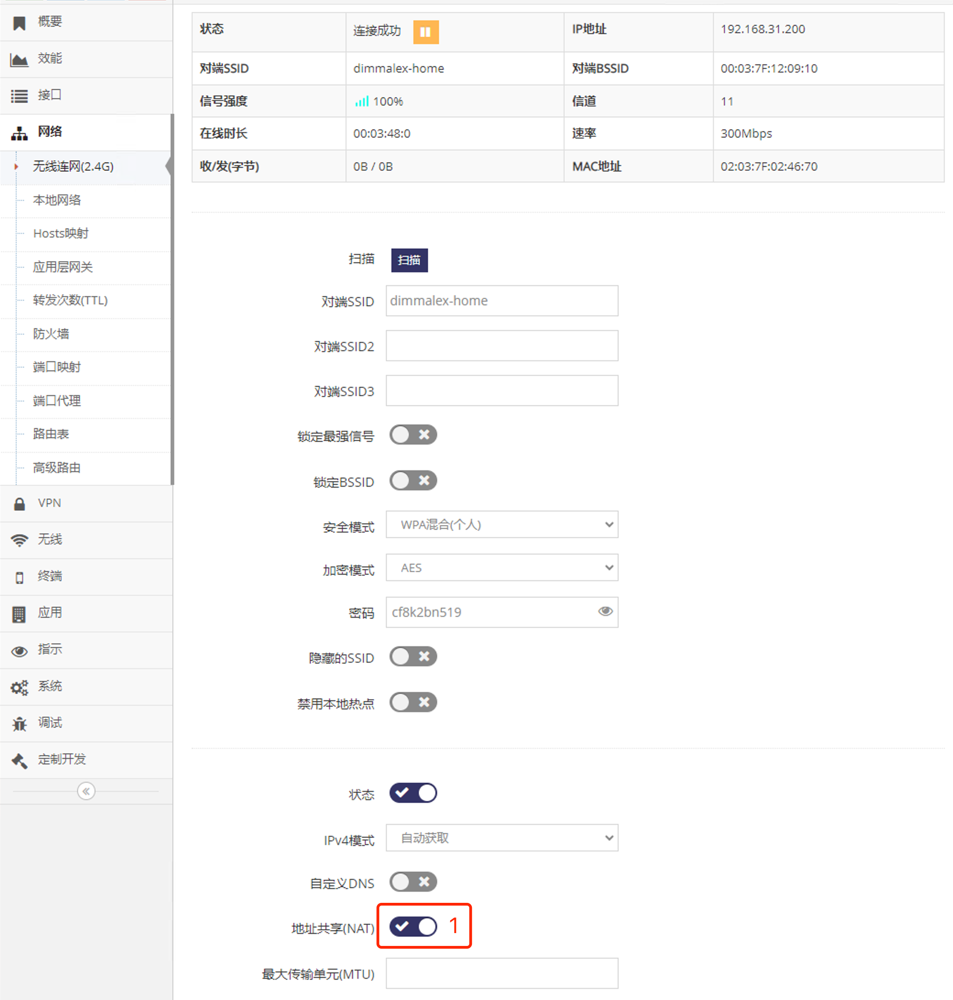
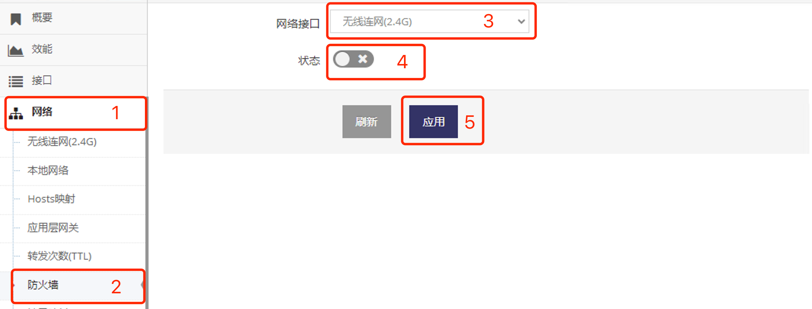

***

## 纯路由模式下无线连网设置

纯路由模式网关的 **上一级路由器(Router)** 可以直接访问到网关LAN上的 **设备或电脑**

 

只需要基于之前原有的 **无线连网** 设置基础上禁用 **地址共享(NAT)**     

- 即在 **无线连网(2.4G)设置界面**(或**无线连网(5.8G)设置界面**) 点击 **红框1** 禁用即可

 

- 为了防止 **上一级路由器(Router)** 访问被防火墙阻止还需要禁用 **无线连网(2.4G)**(或**无线连网(5.8G)**) 的防火墙, 按以下红框数字步骤点选 **无线连网(2.4G)**(或**无线连网(5.8G)**) 禁用即可

 
