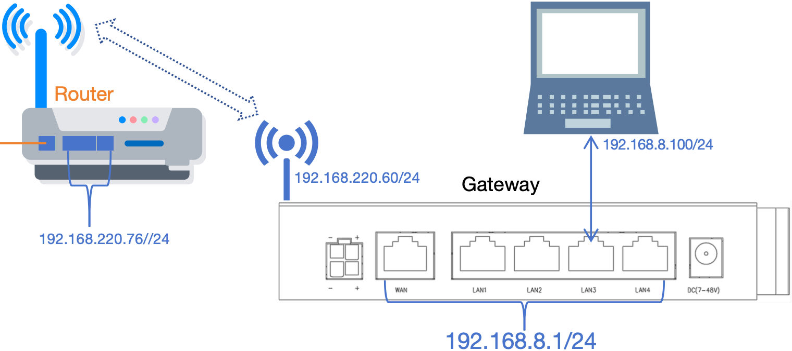
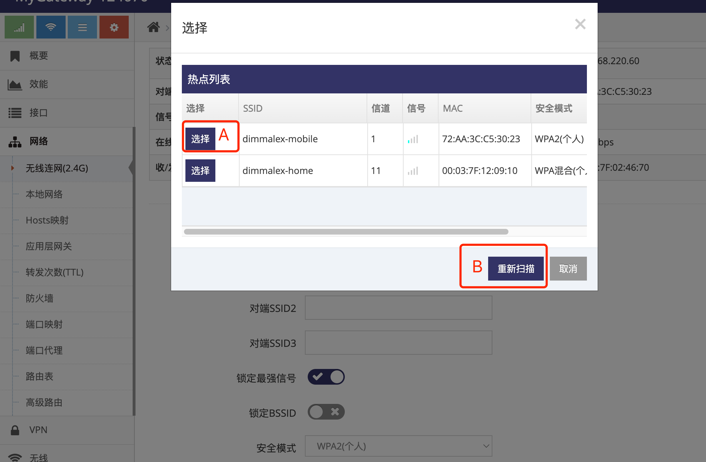

***

## 无线连网静态地址上网设置

无线连网静态地址上网需要以下前提:

- 有支持上网的无线热点, 即上一端路由器提供WIFI热点   
- 静态地址上网需要用户有一定的网络知识  
- 知道上一端路由器的地址(网关)以及域名服务器   
- 还要知道将网关设置成什么地址才可以上网

 

#### 切换无线连网的工作模式

首先将网关的工作模式切换为 **2.4G无线连网网关**(或**5.8G无线连网网关**)

- 点击 **红框1** 的 **系统** 菜单下的 **红框2** 的 **设备管理** 进入 **设备管理设置界面**   

- 点击 **红框3** 点击 **2.4G无线连网网关**(或**5.8G无线连网网关**) 后, 点击 **红框4** 应用, 提示重启点击 **确定** 等待网关重启完成即可   

 

具体是切换为 **2.4G无线连网网关** 还是 **5.8G无线连网网关** 取决于要连接的SSID是 **2.4G** 的还是 **5.8G** 的WIFI    
在 **2.4G无线连网网关**(或**5.8G无线连网网关**) 下, 网关的所有WAN/LAN口都可用于接电脑或是其它设备上网用   

#### 设置无线连网静态地址上网

- 请将电脑通过有线接入网关, 通过有线来设置网关的无线连网功能( 如通过无线连接网关在设置时可能出现电脑与网关的连接断开 )    

- 点击 **红框1** 的 **网络** 菜单下的 **红框2** 的 **无线连网(2.4G)**(或**无线连网(5.8G)**) 进入 **无线连网(2.4G)设置界面**(或**无线连网(5.8G)设置界面**)

 

- 点击 **红框3** 的 **扫描** 后, 弹出当前附近的SSID列表, 点击对应SSID前 **红框A** 的 **选择** 后会将SSID信息自动填入 **红框4** 及 **红框7** 中, 然后用户只需在 **红框7** 中的 **密码** 栏填写密码即可

 

- 也可以直接在 **红框4** 中填入要连接的 **SSID名称** 并在 **红框7** 中填写对应的 **安全模式** **加密模式** 及 **密码**, 必须要填写正确否则将无法连接   

- 点击 **红框8** 的 **IPv4模式** 中选择 **手动设置**

- 在 **红框9** 的 **IP地址** 填写要给网关设置的IP地址

- 在 **红框9** 的 **子网掩码** 填写要给网关设置的子网掩码

- 在 **红框9** 的 **网关** 填写上一级的路由器地址

- 在 **红框9** 的 **域名服务器** 填写可用的DNS服务器

- 之后点击 **红框10** 应用即可

- 正常等待1分钟右左即可在 **红框11** 显示连接成功后设置的 **IP地址**   

    - **红框5** 用于填写多个安全方式完全相同的SSID, 网关将连接他们之中的SSID   
    - **红框6** 用于锁定最强信号, 当连接的SSID有多个设备或连接多个SSID时(红框5)时必须点选   
    - **红框B** 用于当热点列表中未显示对应的SSID时可点 **重新扫描** 直到能显示需要连接的SSID   

#### 无线连网上网的可用性检测介绍

参见 **[4G/5G(LTE/NR)上网的可用性检测介绍](../lte/lte_apn_cn.md#4g5gltenr上网的可用性检测介绍为了ltenr网络的可靠性必须阅读)**

## 无线连网网络的相关信息

#### 查看当前无线连网网络的基本状态

在 **无线连网(2.4G)设置界面**(或**无线连网(5.8G)设置界面**) 的上面首先会显示当前无线连网的基本状态

*通过在 **管理界面** 点击 **网络** 菜单下的 **无线连网(2.4G)**(或**无线连网(5.8G)**) 进入*

 

- 1为当前的 **网络状态**, 正常网关会不同的阶段显示如下不同的状态:

    - **正在连接**, 表示正在拨号

    - **连接成功**, 表示已成功连接

    - **未连接**, 连接被手动断开或暂时因为网络问题离线, 网关通常间隔一段时间会恢复

- 2为当前连接的 **SSID**

- 3为当前SSID的 **信号强度**

- 4为连接成功后一直连续 **在线时长**, 重新连接时会清零

- 5为当次连接累计的 **收发字节**, 出现重新连接时会清零( MTK方案中此收发字节不统计将始终为0 )

- 6为获取到的 **IP地址**, 连接成功时才会显示

- 7为当前连接的 **BSSID**, 即连接SSID设备的MAC地址

- 8为当前连接的SSID的 **信道**

- 9为当前连接的SSID理论最大 **速率**

- 10为当前的WISP口的 **MAC地址**

### 查看当前无线连网网络的所有状态信息

在 **管理界面** 点击 **接口** 将会显示 **无线连网(2.4G)**(或**无线连网(5.8G)**) 的所有状态信息

 

**红框2** 中显示所有 **无线连网(2.4G)**(或**无线连网(5.8G)**) 的信息   
